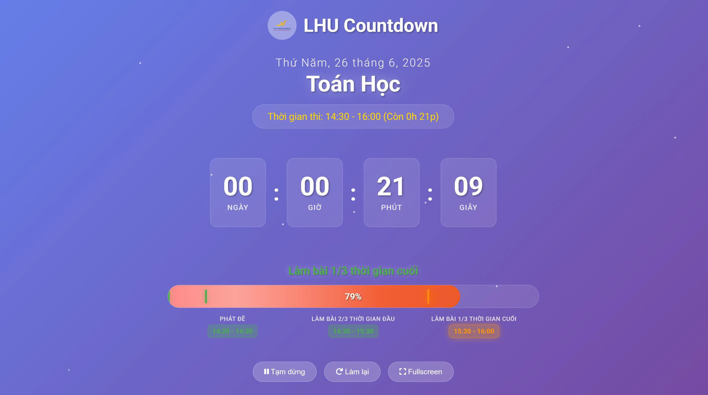

# LHU Countdown - Đếm ngược thời gian thi

[🇬🇧 Xem hướng dẫn tiếng Anh](README.md)

---

## ✨ Tính năng nổi bật
- **Giai đoạn phát đề:** Cho phép nhập thời gian phát đề **từ ... đến ...** trước khi thi. Giai đoạn này được tính vào progress bar và timeline.
- **Form cấu hình thông minh:** Nhập tên môn thi, thời gian thi, thời gian phát đề, các giai đoạn tùy chỉnh.
- **Đồng hồ đếm ngược động:** Hiển thị ngày, giờ, phút, giây với hiệu ứng chuyển động mượt mà.
- **Thanh tiến trình & timeline:** Tất cả giai đoạn (kể cả phát đề) đều hiển thị, giãn đều, không bị chồng chữ, cập nhật theo thời gian thực.
- **Quản lý giai đoạn:** Tự động chuyển đổi giữa các giai đoạn thi, hiển thị rõ ràng.
- **Giao diện fullscreen:** Tối ưu cho màn hình lớn, máy chiếu.
- **Nhiều hiệu ứng animation:**
  - Fade-in cho các phần chính
  - Pulse cho logo và số đếm
  - Glow cho tên môn thi và giai đoạn hiện tại
  - Shimmer cho progress bar
  - Particles động bay nền
  - Chuyển cảnh động khi đổi giai đoạn
  - Hiệu ứng ăn mừng khi hết giờ
- **Lưu trữ dữ liệu:** Tự động lưu và khôi phục cấu hình (localStorage).
- **Phím tắt:** Điều khiển nhanh (Tạm dừng/Tiếp tục, Làm lại, Fullscreen).
- **Responsive:** Tương thích mọi thiết bị (desktop, tablet, mobile).

## 🎨 Giao diện tổng quan
- **Header:** Logo LHU và tiêu đề
- **Ngày tháng:** Hiển thị ngày hiện tại
- **Tên môn thi:** Môn thi đang đếm ngược
- **Đồng hồ đếm ngược:** 4 khối thời gian (ngày, giờ, phút, giây)
- **Thanh tiến trình:** Hiển thị tiến độ và giai đoạn hiện tại, có marker động
- **Timeline:** Tất cả giai đoạn (kể cả phát đề) hiển thị đều, không chồng chữ
- **Nút điều khiển:** Tạm dừng, làm lại, fullscreen

## 🚀 Hướng dẫn sử dụng
1. Mở `index.html` trong trình duyệt.
2. Nhập tên môn thi.
3. Chọn thời gian bắt đầu và kết thúc thi.
4. (Tùy chọn) Bấm **Đặt thời gian phát đề** và nhập **từ** và **đến** cho giai đoạn phát đề.
5. Thêm/sửa các giai đoạn thi nếu cần (ví dụ: "Làm bài", "Kiểm tra", "Nộp bài").
6. Nhấn **Bắt đầu đếm ngược**.
7. Sử dụng phím tắt:
   - `Space`: Tạm dừng/Tiếp tục
   - `R`: Làm lại
   - `F`: Fullscreen

### Lưu ý
- Giai đoạn phát đề sẽ hiển thị đầu tiên trên progress bar và timeline.
- Timeline luôn giãn đều, không bị chồng chữ dù có nhiều giai đoạn.
- Đặt tên file logo **không có ký tự đặc biệt** (ví dụ: `LHU-ASU-ENG1.png` thay cho `LHU&ASU-ENG1@.png`).

## 📁 Cấu trúc file
```
clock_2/
├── index.html          # File HTML chính
├── styles.css          # CSS với hiệu ứng và layout
├── script.js           # JavaScript logic
├── LHU-ASU-ENG1.png    # Ảnh logo (nên đổi tên nếu cần)
├── README.md           # Hướng dẫn tiếng Anh
└── README-vi.md        # Hướng dẫn tiếng Việt (file này)
```

## 🔧 Yêu cầu hệ thống
- Trình duyệt web hiện đại (Chrome, Firefox, Safari, Edge)
- Hỗ trợ CSS Grid và Flexbox
- JavaScript bật
- Kết nối internet (cho Font Awesome icons)

## 🚀 Khởi chạy nhanh
1. Tải xuống tất cả file
2. Mở `index.html` trong trình duyệt
3. Cấu hình thông tin thi, thời gian phát đề, các giai đoạn
4. Bắt đầu đếm ngược!

---

**LHU Countdown** – Công cụ đếm ngược thi động, đẹp, dễ dùng cho sinh viên! 🎓⏰

---

## 🖼️ Ảnh minh họa giao diện



*Trên đây là ví dụ giao diện đếm ngược động với progress bar, timeline và hiệu ứng nổi bật.*

---

> Để xem hướng dẫn tiếng Anh, [bấm vào đây](README.md) 